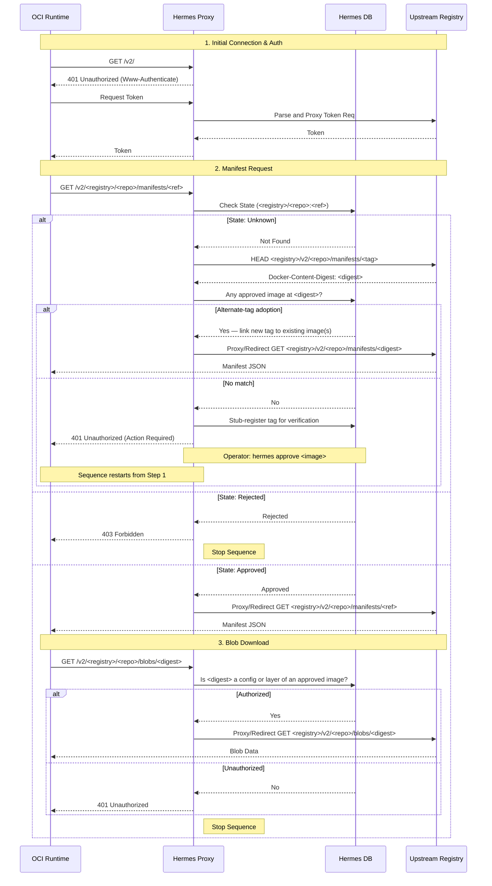
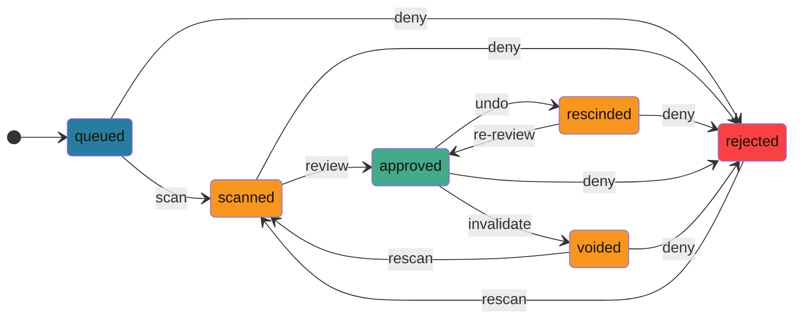
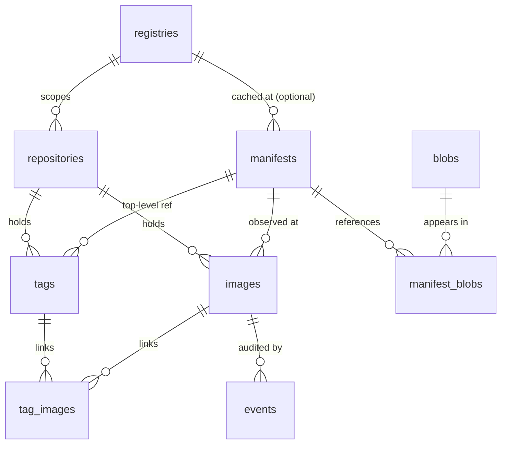

# hermes

**hermes** is an OCI image approval system that acts as a full OCI Distribution
gateway. It combines [trivy](https://aquasecurity.github.io/trivy) vulnerability
scanning with a human-in-the-loop approval workflow, enforcing image policy
before forwarding client requests to upstream registries.

---

## Table of Contents

- [How it works](#how-it-works)
- [Image states](#image-states)
- [Installation](#installation)
  - [Binary](#binary)
  - [Container](#container)
- [Configuration](#configuration)
- [CLI usage](#cli-usage)
  - [scan](#scan)
  - [approve](#approve)
  - [rescind](#rescind)
  - [reject](#reject)
  - [view](#view)
  - [list](#list)
  - [report](#report)
  - [serve](#serve)
- [Gateway API](#gateway-api)
  - [`GET /v2/`](#get-v2)
  - [`GET /v2/<registry>/…`](#get-v2registry)
  - [`GET /ident`](#get-ident)
  - [`GET /healthz`](#get-healthz)
- [Database](#database)

---

## How it works



1. OCI runtime targets `<hermes>` as its registry endpoint, and `<registry>/<repo>` as the repository:
   ```bash
   #                <hermes>   <registry>   <repo>      <ref>
   #           ┌───────┴───────┐ ┌──┴──┐ ┌─────┴─────┐ ┌──┴──┐
   podman pull hermes.domain.tld/quay.io/cilium/cilium:v1.18.6
   ```
2. `hermes` receives OCI Distribution `/v2/` root request:
   1. `hermes` responds `401 UNAUTHORIZED` with `Www-Authenticate` challenge.
   2. OCI runtime requests token.
   3. `hermes` parses request, proxies to and from `<registry>`.
3. OCI runtime requests `/v2/<registry>/<repo>/manifest/<ref>`:
4. `hermes` receives manifest request, checks DB:
   - **Unknown** → probes the upstream for the tag's content digest. If that digest is already linked to an approved image in the same repository (an "alternate tag"), the new tag is registered, linked to the existing image rows, and the request is forwarded. Otherwise the tag is stub-registered for review and `401 UNAUTHORIZED` is returned.
     1. An operator uses the CLI to `scan`, `approve`, or `reject` queued images.
     2. Once `approved`, the image can be pulled.
   - **Approved** → proxies or redirects the request to the upstream registry:
     1. OCI runtime requests `/v2/<registry>/<repo>/blobs/<digest>`.
     2. `hermes` checks the database — only blobs that appear as the `config` or one of the `layers[]` of an approved image's manifest are forwarded; everything else returns `401 UNAUTHORIZED`.
   - **Rejected** → returns `403 DENIED` (stop sequence).

---

## Image states

| State       | Group      | Description |
|:-----------:|:----------:|:------------|
| `queued`    | `pending`  | Metadata saved; no scan report. |
| `scanned`   | `pending`  | Scan performed and stored. |
| `rejected`  | `verified` | Operator deemed the image unsafe for use. |
| `approved`  | `verified` | Operator reviewed and approved the scan, imaged optionally cached. |
| `rescinded` | `pending`  | Operator withdrew for review; effectively back to `scanned`. |
| `voided`    | `pending`  | Image not cached, no longer exists upstream; effectively back to `queued`. |
| `errored`   |            | An error occurred during scanning or cache push. |

State transitions:



---

## Installation

### Binary

```bash
git clone https://github.com/leshaunj/hermes
cd hermes
go build -o hermes .
sudo mv hermes /usr/local/bin/
```

### Container

Build the image from the `Containerfile`:

```bash
podman build -t hermes -f Containerfile .
# or
docker build -t hermes -f Containerfile .
```

Run (_mounting the config and Docker socket for `trivy`_):

```bash
docker run -d \
  --name hermes \
  -v /etc/hermes.yaml:/etc/hermes.yaml:ro \
  -v /var/run/docker.sock:/var/run/docker.sock \
  -p 8080:8080 \
  hermes
```

---

## Configuration

hermes reads `/etc/hermes.yaml` on startup (_override with `--config`_).

```yaml
server:
  addr: ":8080"          # listen address
  url:  ""               # public base URL (default: http://<hostname>:<port>)
  redirect: false        # 307-redirect upstream traffic instead of proxying

db:
  host:     localhost
  port:     5432
  user:     hermes
  password: secret
  name:     hermes
  sslmode:  disable      # disable | require | verify-ca | verify-full

trivy:
  image:        aquasec/trivy:latest   # Docker image for trivy
  args:         []                     # extra args for `trivy image`
  convert_args: []                     # extra args for `trivy convert`

log:
  format: json           # json (Loki-compatible) | journald (systemd fields)
  level:  info           # debug | info | warn | error

cache_url: ""            # default registry for `hermes approve --cache`
```

`server.url` is used to rewrite `WWW-Authenticate` realm headers so Docker
clients obtain bearer tokens through the `/ident/` proxy. It defaults to
`http://<hostname>:<port>` if not explicitly set.

`server.redirect` controls how authorized upstream traffic (manifests, blobs,
tag lists) is forwarded. When `false` (default), hermes reverse-proxies the
request. When `true`, hermes sends an HTTP 307 redirect to the upstream URL —
useful when clients have direct access to the upstream registry. Automatic
voiding of approved-but-disappeared digests (see [Image states](#image-states))
requires proxy mode, because hermes never observes the upstream response in
redirect mode.

`log.format` selects the global logger wire format:

- `json` (default) emits standard `slog` JSON — `time`, `level` (slog label),
  `msg`, and attributes at the top level. Suitable for Loki, Promtail, Vector,
  and similar pipelines.
- `journald` emits JSON using systemd-journal field conventions: `MESSAGE`
  replaces `msg`, `PRIORITY` replaces `level` as a syslog priority digit
  (`0`-`7`), and `time` is dropped (journald stamps its own).

`hermes serve` subscribes to a Postgres `LISTEN hermes_events` channel and
streams every newly persisted event through the global logger, so operators
can tail gateway audit activity through `journalctl` or a Loki query without
reading the database.  Both CLI (`approve`, `scan`, etc.) and API events
flow through the same channel, so the container log stream is unified
regardless of whether the event originated from a `docker exec hermes ...`
invocation, a standalone binary on the same host, or a gateway request
handler inside `serve` itself.  CLI processes do not write their own slog
output — every event reaches the log stream via `serve`'s listener.

A JSON Schema is provided at [`docs/hermes.schema.json`](docs/hermes.schema.json).

Environment variables prefixed with `HERMES_` override file values (e.g.
`HERMES_DB_PASSWORD`).

---

## CLI usage

All CLI commands accept `--config <path>` (default: `/etc/hermes.yaml`).

Every command that takes an `IMAGE` argument accepts the form
`[<registry>/][<namespace>/]<name>:<tag>`.  The registry prefix is detected
using the standard Docker heuristic — the first segment must contain `.`,
`:`, or be exactly `localhost`.  When no registry is supplied, hermes looks
across its database for every registry currently hosting that
`<name>[:<tag>]`: if exactly one matches it is used automatically, if several
match you are prompted to pick one, and if none match hermes falls back to
`docker.io` (so `hermes scan`/`hermes approve` can still queue a brand-new
image from Docker Hub).

### scan

```
hermes scan [--force] [--platform OS/ARCH] IMAGE
```

Queues `IMAGE` if it does not already exist, fetches its manifest, runs a trivy
scan, saves the report, and prints the trivy table to stdout. Use
`hermes report IMAGE --format json` (or any other format) for a machine-readable
view after the scan completes.

If the image already has a scan report, the existing report is printed unless
`--force` is given.  Scans are attached to the manifest digest, not the
`(registry, repository)` location, so scanning the same digest reused at a
second repo returns the existing report without re-running trivy.

> ```bash
> hermes scan registry.example.com/myapp:v1.2.3
> hermes scan --force registry.example.com/myapp:v1.2.3
> hermes scan --platform linux/amd64 registry.example.com/myapp:v1.2.3
> ```

### approve

```
hermes approve [--platform OS/ARCH] [--cache [URL]] IMAGE
```

Shows the trivy scan report as a table (scanning first if needed) and prompts:

```
Approve this image? [YES / NO / REJECT] (default: NO):
```

- **YES** — sets state to `approved`; exits 0.
- **NO** — no change; exits 0.
- **REJECT** — sets state to `rejected`; exits non-zero so the operator's shell
  pipeline can treat it as a hard deny.

Approval state is attached to the manifest digest — once a digest is approved,
every `(registry, repository)` location observing the same digest inherits
the verdict.  Use `hermes rescind` to undo.

If `--cache` is provided, the image is pushed to `URL` (or `cache_url` from the
config if no URL is given) upon `YES`. A successful push records the cache
registry in the database and the gateway forwards future manifest and blob
requests for the image to the cache registry instead of the origin — so the
image stays pullable even if the origin later removes or rewrites its digest.
A failed push sets the state to `errored`.

> ```bash
> hermes approve registry.example.com/myapp:v1.2.3
> hermes approve --cache registry.example.com/myapp:v1.2.3
> hermes approve --cache cache.internal.example.com registry.example.com/myapp:v1.2.3
> ```

### rescind

```
hermes rescind [--platform OS/ARCH] IMAGE
```

Sets an `approved` image to `rescinded`, immediately blocking it from passing
the gateway check.  Without `--platform` hermes filters IMAGE to its approved
platforms: if exactly one is approved it is selected automatically, and if
several are approved you are prompted to pick one.  You are then asked to
confirm before the rescind is recorded.  The image can be re-approved with
`hermes approve`.

> ```bash
> hermes rescind registry.example.com/myapp:v1.2.3
> hermes rescind --platform linux/amd64 registry.example.com/myapp:v1.2.3
> ```

### reject

```
hermes reject [--platform OS/ARCH] IMAGE
```

Prompts for confirmation then sets the image to `rejected`. Rejected images
return `403 DENIED` at the gateway.

> ```bash
> hermes reject registry.example.com/myapp:v1.2.3
> hermes reject--platform linux/amd64 registry.example.com/myapp:v1.2.3
> ```

### view

```
hermes view [--platform OS/ARCH] IMAGE
```

Prints all stored information for an image — state, digest, cache registry,
timestamps, a vulnerability summary, and the full scan report.

> ```bash
> hermes view registry.example.com/myapp:v1.2.3
> hermes view --platform linux/amd64 registry.example.com/myapp:v1.2.3
> ```

### list

```
hermes list [--platform OS/ARCH] [--state STATE[,...]] [--json] [REF ...]
```

Lists tracked images in a table. `--state` accepts individual states
(`queued`, `scanned`, `approved`, `rescinded`, `rejected`, `errored`) or group
names (`pending`, `verified`). Multiple values can be comma-separated or given
as repeated flags. `REF` arguments filter by
`[<registry>/][<namespace>/]<name>[:<tag>]`; the registry prefix is detected
using the standard Docker heuristic (first segment contains `.`, `:`, or is
`localhost`).

Images that have been stub-registered (seen at the gateway but not yet scanned)
show `-` for OS, arch, and digest.

> ```bash
> hermes list
> hermes list --state approved
> hermes list --platform linux/amd64 --state pending
> hermes list --state verified --json
> hermes list myapp:v1.2.3 otherapp
> hermes list registry.example.com/myapp:v1.2.3
> ```

### report

```
hermes report [--format FORMAT] [--output FILE] [--platform OS/ARCH] IMAGE
```

Retrieves the stored trivy JSON report and converts it using `trivy convert`.
Supported formats: `table`, `json`, `template`, `sarif`, `cyclonedx`, `spdx`,
`spdx-json`, `github`, `cosign-vuln`. Output goes to stdout or `FILE`.

> ```bash
> hermes report registry.example.com/myapp:v1.2.3
> hermes report --format sarif --output report.sarif registry.example.com/myapp:v1.2.3
> hermes report --format cyclonedx registry.example.com/myapp:v1.2.3 | jq .
> ```

### serve

```
hermes serve [--config PATH]
```

Starts the OCI gateway server.

> ```bash
> hermes serve
> hermes serve --config /path/to/hermes.yaml
> ```

### health

```
hermes health
```

CLI version of the [`GET /healthz`](#get-healthz) endpoint.

> [!NOTE]
> This mostly exists to function as the `CMD` for `HEALTHCHECK` in the `Containerfile`, 
> as it would otherwise be unsure of what [`server.addr`](#configuration) is.

---

## Gateway API

hermes implements the OCI Distribution v2 API as a gateway. Configure your
container runtime or mirror tool to use hermes as its registry endpoint.

### `GET /v2/`

Returns `401 UNAUTHORIZED` with a `WWW-Authenticate: Bearer` challenge pointing
to [`/ident`](#get-ident).

This is the standard OCI v2 capability ping; all clients hit this first to
negotiate auth.

### `GET /v2/<registry>/…`

All OCI Distribution sub-paths rooted at `/v2/<registry>/` are handled:

**Manifest paths** (`/v2/<registry>/<repo>/manifests/<ref>`):

| Image state | Response |
|-------------|----------|
| `approved`  | `200 OK` proxied/redirected from upstream |
| `rejected`  | `403 DENIED` (CNCF JSON error body) |
| `pending`   | `401 UNAUTHORIZED`; tag stub-registered |

When `<ref>` is a digest (`sha256:…`), the lookup short-circuits any
alternate-tag handling: a request for an approved digest is forwarded
immediately, regardless of which tag the client may have used previously.

When `<ref>` is a tag name and the tag is unknown, hermes probes the upstream
for the tag's `Docker-Content-Digest`.  If that digest is already linked to an
**approved** image in the same repository (an "alternate tag" — typical for
floating tags such as `latest`), the new tag is registered, linked to the
existing image rows, and the request is forwarded.  Otherwise the tag is
stub-registered for operator review and `401 UNAUTHORIZED` is returned.

**Blob paths** (`/v2/<registry>/<repo>/blobs/<digest>`):

Blob downloads are gatekept by the database — they are forwarded **only** when
`<digest>` appears (via [`manifest_blobs`](#manifest_blobs)) as the `config`
blob or one of the `layer` blobs of a manifest that is observed at the same
`(registry, repository)` and is currently `approved`.  Unauthorized blobs
return `401 UNAUTHORIZED`.  This stops clients from streaming arbitrary
content through the gateway by guessing or replaying digests.

**Other paths** (tag lists, blob uploads, catalog, etc.):

Forwarded unconditionally to `https://<registry>/v2/<repo>/…` via proxy or
307 redirect (controlled by `server.redirect`).

### `GET /ident`

Token-acquisition proxy. The OCI client sends its bearer-token request as:

```
GET /ident?scope=repository:<registry>/<repo>:pull
```

hermes will:
- Extract the `<registry>`, `<repo>` from the request.
- Extract the genuine `<realm>`, `<service>` and `<scope>` from `GET <registry>/v2/<repo>/tags/list`.
- Proxy to `GET <realm>?service=<service>&scope=<scope>`.

### `GET /healthz`

Returns `ok\n` with status `200`. Used as a container liveness probe.

---

## Database

hermes uses PostgreSQL and creates its tables automatically on first run via
`hermes serve`.

### `registries`

| Column       | Type          | Description |
|--------------|---------------|-------------|
| `id`         | `bigserial`   | Primary key |
| `mask`       | `bigint`      | FK → `registries.id` (nullable), cascades on delete |
| `url`        | `text`        | Registry base URL (e.g. `registry.example.com`) |
| `created_at` | `timestamptz` | |
| `updated_at` | `timestamptz` | |

> [!NOTE]
> The optional `registries.mask` foreign key is a `registries.id` whose
> `registries.url` should be used during display purposes.
> For instance, with:
> 
> | id | mask |         url          | created_at | updated_at |
> |----|------|----------------------|------------|------------|
> |  1 |      | docker.io            | ...        | ...        |
> |  2 |    1 | index.docker.io      | ...        | ...        |
> |  3 |    1 | registry-1.docker.io | ...        | ...        |
> 
> `docker.io` is the registry the user will see in commands like `hermes list`,
> when the actual registry is `registry-1.docker.io` or `index.docker.io`.
> CLI operations also collapse masked aliases onto their canonical root
> before writing anything, so `hermes approve docker.io/foo:v1`,
> `hermes approve index.docker.io/foo:v1`, and
> `hermes approve registry-1.docker.io/foo:v1` all target the same
> (registry, repository, tag) row in the database.
> Additionally, API requests to `/v2/docker.io/...` will resolve to
> `/v2/registry-1.docker.io/...` (_the last of any rows with this mask_).

The schema separates **content** (manifest body, blobs, scan report, approval
state, cache registry — all keyed on manifest digest) from **location /
provenance** (which `(registry, repository)` and which `tags` have served a
given digest).  Because a manifest's digest uniquely identifies its bytes,
every scan, approval verdict, and cache target is stored once per digest and
shared by every location that hosts it.



### `repositories`

One row per `(registry, path)` pair.  Every tag and image references a
repository via FK, keeping the repository string in one place.

| Column       | Type          | Description |
|--------------|---------------|-------------|
| `id`         | `bigserial`   | Primary key |
| `registry`   | `bigint`      | FK → `registries.id` (`ON DELETE CASCADE`) |
| `path`       | `text`        | e.g. `myorg/myapp` |
| `created_at` | `timestamptz` | |
| `updated_at` | `timestamptz` | |

### `tags`

One row per `(repository, name)`.  A tag with no rows in
[`tag_images`](#tag_images) is a "stub" — seen at the gateway but not yet
populated.  `manifest` is the top-level (image manifest or index) reference
the tag last resolved to and is the lookup key for alternate-tag adoption.

| Column       | Type          | Description |
|--------------|---------------|-------------|
| `id`         | `bigserial`   | Primary key |
| `repository` | `bigint`      | FK → `repositories.id` (`ON DELETE CASCADE`) |
| `name`       | `text`        | e.g. `v1.2.3` |
| `manifest`   | `bigint`      | FK → [`manifests.id`](#manifests); NULL for stubs |
| `created_at` | `timestamptz` | |
| `updated_at` | `timestamptz` | |

### `manifests`

Content-addressed store: one row per manifest digest, globally.  Because the
manifest bytes determine the digest, every derived property lives here —
raw body, platform hints, scan report, approval state, and optional cache
registry.  Two `(registry, repository)` locations observing the same digest
share a single manifest row and therefore a single verdict.

| Column           | Type          | Description |
|------------------|---------------|-------------|
| `id`             | `bigserial`   | Primary key |
| `digest`         | `text`        | `sha256:…`, unique |
| `media_type`     | `text`        | OCI/Docker manifest media type |
| `body`           | `jsonb`       | Raw manifest bytes (forwarded verbatim by the gateway) |
| `arch`           | `text`        | e.g. `amd64`, `arm64`; NULL for index manifests |
| `os`             | `text`        | e.g. `linux`, `windows`; NULL for index manifests |
| `scan_report`    | `jsonb`       | Raw trivy JSON report; NULL until first scan |
| `scanned_at`     | `timestamptz` | Last scan timestamp |
| `cache_registry` | `bigint`      | FK → `registries.id`; set after a successful cache push |
| `state`          | `state`       | Current state (see [Image states](#image-states)) |
| `created_at`     | `timestamptz` | |
| `updated_at`     | `timestamptz` | |

### `blobs`

Content-addressed catalog of every config/layer digest referenced by any
manifest.  Populated during manifest ingestion and used by the gateway's blob
authorization check.

| Column       | Type          | Description |
|--------------|---------------|-------------|
| `id`         | `bigserial`   | Primary key |
| `digest`     | `text`        | `sha256:…`, unique |
| `size`       | `bigint`      | From the manifest descriptor; nullable |
| `media_type` | `text`        | From the manifest descriptor; nullable |
| `created_at` | `timestamptz` | |

### `manifest_blobs`

Many-to-many link from [`manifests`](#manifests) to the config and layer
[`blobs`](#blobs) they reference.  Replaces JSONB containment for blob
gatekeeping — `BlobAuthorized` is now a plain B-tree indexed JOIN on
`manifest_blobs(blob)`.

| Column     | Type     | Description |
|------------|----------|-------------|
| `manifest` | `bigint` | FK → `manifests.id` (`ON DELETE CASCADE`) |
| `blob`     | `bigint` | FK → `blobs.id` (`ON DELETE CASCADE`) |
| `role`     | `text`   | `config` or `layer` |
| `ordinal`  | `int`    | Layer order; NULL for config |

Primary key: `(manifest, blob, role)`.

### `images`

Pure provenance row: "this manifest was observed at this repository".  State,
scan, and cache live on [`manifests`](#manifests); an `images` row simply
records the `(repository → manifest)` observation and is what
`events.image_id` audits against.

| Column       | Type          | Description |
|--------------|---------------|-------------|
| `id`         | `bigserial`   | Primary key |
| `repository` | `bigint`      | FK → `repositories.id` (`ON DELETE CASCADE`) |
| `manifest`   | `bigint`      | FK → `manifests.id` |
| `created_at` | `timestamptz` | |
| `updated_at` | `timestamptz` | |

Unique on `(repository, manifest)`.

### `tag_images`

Many-to-many link between [`tags`](#tags) and [`images`](#images).  A row in
this table means "this tag currently resolves to this `(repository, manifest)`
observation".  Both foreign keys cascade on delete.

| Column       | Type          | Description |
|--------------|---------------|-------------|
| `tag`        | `bigint`      | FK → `tags.id` (`ON DELETE CASCADE`) |
| `image`      | `bigint`      | FK → `images.id` (`ON DELETE CASCADE`) |
| `created_at` | `timestamptz` | |

### `events`

Append-only audit log of every CLI and API action.

| Column       | Type          | Description |
|--------------|---------------|-------------|
| `id`         | `bigserial`   | Primary key |
| `image_id`   | `bigint`      | FK → `images.id` (nullable) |
| `source`     | `text`        | `cli` or `api` |
| `event_type` | `text`        | e.g. `scan`, `approve`, `validate_approved`, `validate_adopted`, `validate_voided`, `blob_approved`, `blob_denied`, `blob_voided` |
| `details`    | `text`        | JSON with context-specific fields |
| `created_at` | `timestamptz` | |
